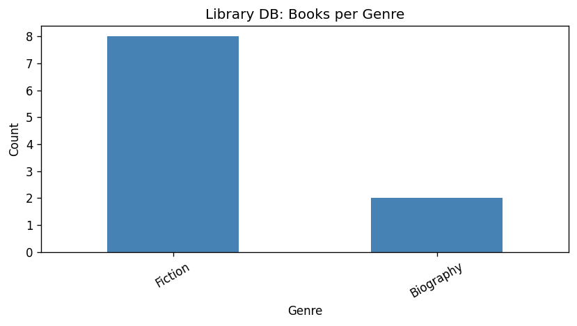
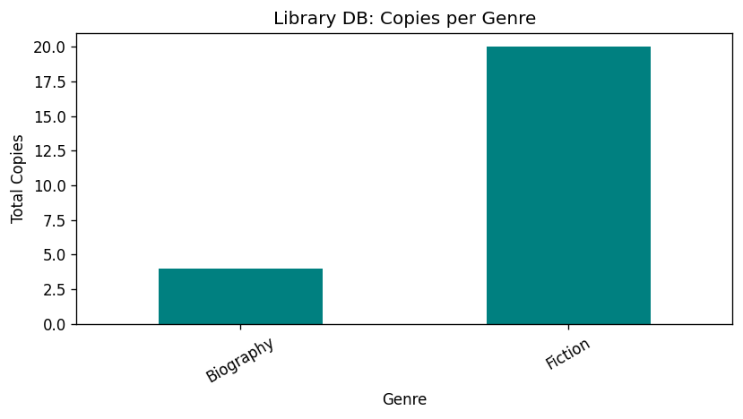
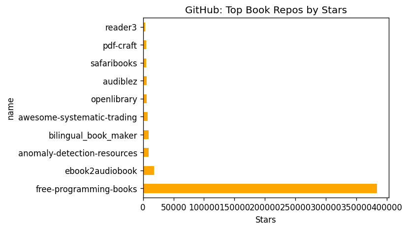
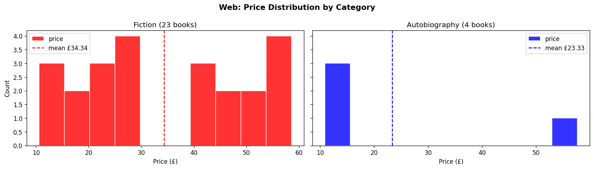
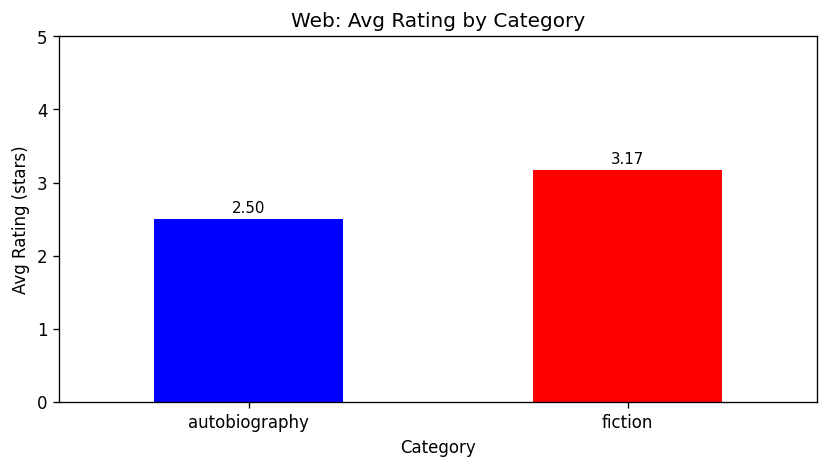
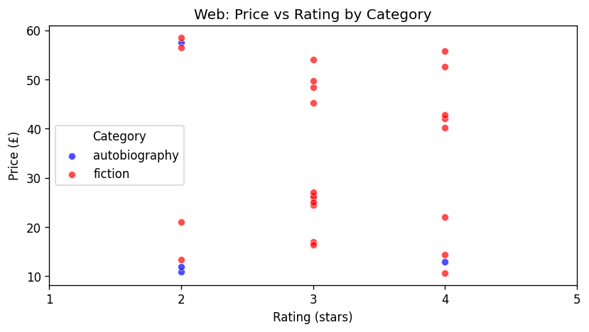

# Executive Summary

The report analyzes book market data collected from 3 different sources

- Library Database
- Github Repositories related to books
- Web-scraped book listings

Data Collected Include

27 book records from web scraping
10 records from local library database
10 Github Repositories

Key Findings Show that

- Most starred github book repo is related to programming books (EbookFoundation/free-programming-books with 383,759 stars)
- Book rating has no direct relationship with prices
- Fiction books are more numerous and higher rated than autobiography books

# Data Collection Statistics

Source: Local Library Database
Records: 10
Categories: 2
    Biography: 2
    Fiction: 8

Source: http://books.toscrape.com
Records: 27
Categories: 2
    Autobiography: 4
    Fiction: 23

Source: Github Books Repositories
Repos: 10

# Market Insights

**Popularity**
- Number of fiction books is greater than number of autobiography books (23 vs 4 from web scraping, 8 vs 2 from library)

**Price Trends**
- Fiction books have a higher average price (£34.34) compared to autobiography books (£23.33)
- There is no specific trend in prices in relation to ratings, as books occupy the full range of prices across all rating levels

**Rating Patterns**
- Fiction books are rated higher on average (3.2 stars) than autobiography books (2.5 stars)
- The cheapest book is 'I Am Pilgrim (Pilgrim #1)' at £10.60 (fiction, rated 4 stars)

**Technology Trends (GitHub)**
- The most starred book-related repository is EbookFoundation/free-programming-books with 383,759 stars, indicating strong community interest in programming and technical books
- Book-related Python repositories on GitHub are dominated by programming reference materials rather than fiction or general literature

# Visualizations

1. **Library DB: Books per Genre** — Bar chart showing the count of books per genre in the local library database. Fiction dominates with 8 books vs 2 biographies.

2. **Library DB: Copies per Genre** — Bar chart showing total copies available per genre in the library database.

3. **GitHub: Top Book Repos by Stars** — Horizontal bar chart of the top 10 book-related GitHub repositories ranked by star count. EbookFoundation/free-programming-books leads by a large margin.

4. **Web: Price Distribution by Category** — Overlapping histogram comparing price distributions for fiction (red) and autobiography (blue) books scraped from books.toscrape.com. Dashed vertical lines mark each category's mean price.

5. **Web: Avg Rating by Category** — Bar chart comparing average star ratings between fiction (3.2) and autobiography (2.5) categories.

6. **Web: Price vs Rating Scatter** — Scatter plot of price against rating for all scraped books, colored by category. Confirms no clear positive or negative correlation between price and rating.

# Recommendations

- **Library acquisition**: Given the higher demand and ratings for fiction, the library should consider expanding its fiction collection relative to biography/autobiography titles.
- **Pricing strategy**: Since price and rating are uncorrelated, pricing decisions should not rely on perceived quality signals from ratings alone.
